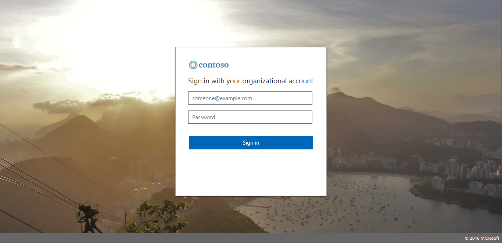

# Match AAD Centered Login Page 

## Overview

This project provides an ADFS style sheet to allow your ADFS UI to be consistent with the [new Azure AD Centered UI experience](https://cloudblogs.microsoft.com/enterprisemobility/2017/08/02/the-new-azure-ad-signin-experience-is-now-in-public-preview/). 
Note that this customization DOES NOT currently support the paginated sign-in experience that AAD provides. However, most other 
aspects of the look-and-feel of the AAD Centered UI experience are matched. 

## Getting Started 

1. Download the ```ThemeCenterBrand.css``` file to your ADFS server, wherever you host your style sheets.
    Note: It is recommended that you minify your CSS for a production environment  

2. Create a custom web theme using the following command in PowerShell: 

    ```New-AdfsWebTheme –Name custom -SourceTheme default –StyleSheet @{path=”c:\style\ThemeCenterBrand.css”}```

3. Apply the new custom web theme using the following command in PowerShell:

    ```Set-AdfsWebConfig -ActiveThemeName custom```

4. Update the logo and background image. For details and image size recommendations, see [this post](https://docs.microsoft.com/en-us/windows-server/identity/ad-fs/operations/azure-ux-web-theme-in-ad-fs)

## Example



## Contributing (Special Note)

If you find any problems with the CSS (or docs), please fork and send us your fix. If you don't 
have a fix, please open an issue, and describe what you are seeing (feel free to include screenshots).

For the full Contributing details, please see __[the root README](../README.md)__.