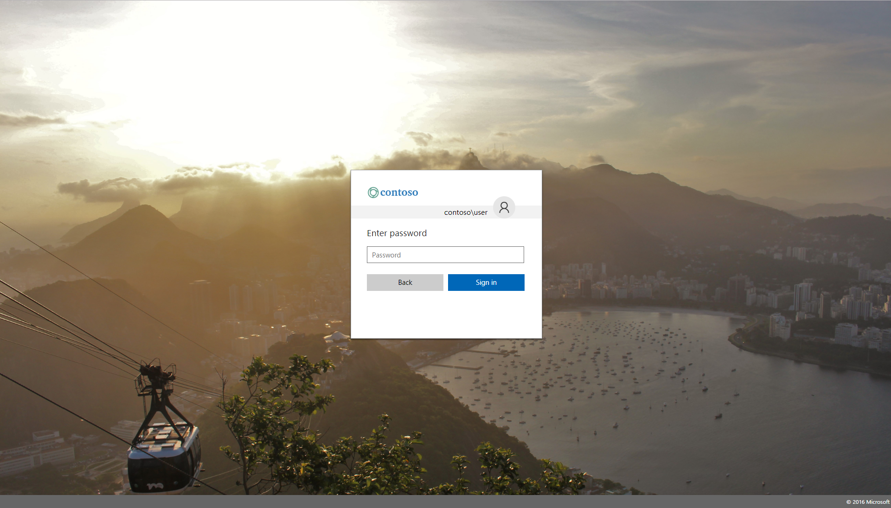

# Match AAD Centered Login Page 

## Overview

This project provides an ADFS style sheet to allow your ADFS UI to be consistent with the [new Azure AD Centered UI experience](https://cloudblogs.microsoft.com/enterprisemobility/2017/08/02/the-new-azure-ad-signin-experience-is-now-in-public-preview/). 

Note that this customization comes in two parts. The first is a style sheet, which allows the look-and-feel of your ADFS to match the AAD Centered UI experience. The second is a more advanced customization, using the ADFS JavaScript customization feature to create a front-end paginated sign-in experience.  

## Getting Started 

We will break the deployment of this feature into two parts. First, the style sheet to create a consistent look-and-feel. Second, the JavaScript to create a front-end paginated experience. 

## Getting Started - Style Sheet Deployment 

1. Download the ```ThemeCenterBrand.css``` file to your ADFS server, wherever you host your style sheets.
    Note: It is recommended that you minify your CSS for a production environment  

2. Create a custom web theme using the following command in PowerShell: 

    ```New-AdfsWebTheme –Name custom –StyleSheet @{path=”c:\style\ThemeCenterBrand.css”}```

3. Apply the new custom web theme using the following command in PowerShell:

    ```Set-AdfsWebConfig -ActiveThemeName custom```

4. Update the logo and background image. For details and image size recommendations, see [this post](https://docs.microsoft.com/en-us/windows-server/identity/ad-fs/operations/azure-ux-web-theme-in-ad-fs)

## Getting Started - JavaScript Deployment 

1. Download the ```paginatedOnload.js``` file to your ADFS server, wherever you host your JavaScript. 
    
    Note: It is *__highly__* recommended that you minify your ```paginatedOnload.js``` before including it in a production environment. There are many popular tools online 
    for minifying JavaScript code. Two popular choices are [minifier.org](http://www.minifier.org/) and [JSCompress](https://jscompress.com/).

2. Modify your existing custom web theme from the style sheet deployment to include the new JavaScript. In PowerShell: 

    ```Set-AdfsWebTheme –TargetName custom -AdditionalFileResource @{Uri=’/adfs/portal/script/onload.js’; path="c:\paginatedOnload.js"}```

4. Apply the modified custom web theme using the following command in PowerShell: 

    ```Set-AdfsWebConfig -ActiveThemeName custom```

5. For more information on JavaScript customization, see [Advanced ADFS Customization](https://docs.microsoft.com/en-us/windows-server/identity/ad-fs/operations/advanced-customization-of-ad-fs-sign-in-pages)

## Example



## Contributing (Special Note)

If you find any problems with the CSS, JavaScript, or docs, please fork and send us your fix. If you don't 
have a fix, please open an issue, and describe what you are seeing (feel free to include screenshots).

For the full Contributing details, please see __[the root README](../README.md)__.