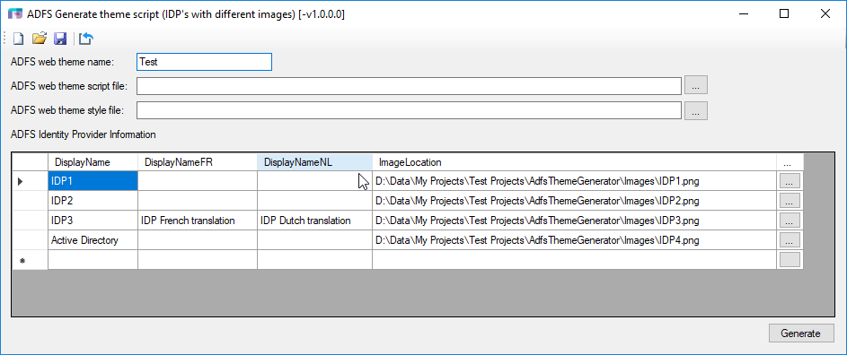
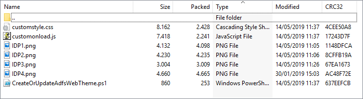
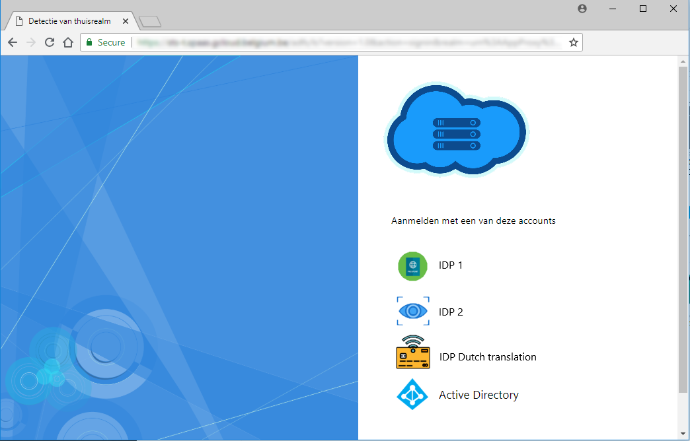

Update ADFS webtheme in order to display different IDP images 
==============================================================

Concept
-------

To modify the layout of the ADFS home realm detection page, ADFS provides the concept of a web theme.

A web theme is a collection of following web artifacts:

\+---css  
¦       style.css  
¦       style.rtl.css  
¦  
+---illustration  
¦       illustration.png  
¦  
+---images  
¦   +---idp  
¦           idp.png  
¦           localsts.png  
¦           otherorganizations.png  
¦  
+---script  
        onload.js

This tree structure holds the artifacts we will update in order to be able to show for each IDP (identity provider) a different image.

ADFS also provides a couple of PowerShell cmdlets to work with the concept of web theme.

The cmdlets we will use are:

- **Get-AdfsWebTheme -Name WebThemeName**

 - Retrieve a reference to an existing web theme or null if it doesn’t exist.

 
- **New-AdfsWebTheme –Name WebThemeName –SourceName default**
 
 - Create a new webtheme based on an existing webtheme.

 
- **Set-AdfsWebTheme -TargetName WebThemeName -AdditionalFileResource …**
 
 - Associate additional artifacts with an existing webtheme (images, customized onload script, custom stylesheet, …)

 
- **Set-AdfsWebConfig -ActiveThemeName WebThemeName**
 
 - Activate an existing webtheme via its name.

 
Tooling
-------

Although the concept of performing these kind of updates is not difficult, the mere fact that the ADFS webtheme cmdlets have to be invoked using references to external resources makes it an repetitive and error prone task. To avoid this I have created a very small RAD utility that can speed up dramatically this task, even more if there are a lot of identity providers on the home realm detection page.



You can populate the list of display names manually. These names have to correspond with the display names they have been given in the ADFS management
console. You can also export the list of claim provider trust display names to a text file as follows:

**Get-AdfsClaimsProviderTrust \| select \@{Name="CPTName";Expression={\$_.Name}} \> [outputFile].txt**

You can then import the list of display names in the utility by clicking on the button .

Once the list of IDP display names is imported you can browse for a corresponding image. Optionally you can also change the translation of the display name (the utility provides translation to Dutch and French, but this is easy to change for other languages).
You have the option of saving the definition file (extension \*.awi) and reloading a definition file.

If you already have customized the onload.js or style.css, you can browse for these artifacts. The modifications for this utility will then be applied to the selected artifacts in stead of the default ones (the plain vanilla ADFS 2016 version).

If all the display names have an associated image, you click on the button ‘Generate’. The tool will ask for a name to save the file as, and will create a zip archive with the selected name.

The zip file contains the following artifacts:



Archive contents (example with the four IDP's)<br>
--------------------

### CreateOrUpdateAdfsWebTheme.ps1<br>

This file contains the collection of ADFS PowerShell cmdlets that perform the webtheme update:

```

$webThemeName = 'Test'

$webTheme = Get-AdfsWebTheme -Name \$webThemeName

if (!\$webTheme)
{
	New-AdfsWebTheme -Name Test -SourceName default
}

Set-AdfsWebTheme -TargetName Test -AdditionalFileResource \@{Uri="/adfs/portal/images/idp/IDP1.png";path="IDP1.png"}

Set-AdfsWebTheme -TargetName Test -AdditionalFileResource \@{Uri="/adfs/portal/images/idp/IDP2.png";path="IDP2.png"}

Set-AdfsWebTheme -TargetName Test -AdditionalFileResource \@{Uri="/adfs/portal/images/idp/IDP3.png";path="IDP3.png"}

Set-AdfsWebTheme -TargetName Test -AdditionalFileResource \@{Uri="/adfs/portal/images/idp/IDP4.png";path="IDP4.png"}

Set-AdfsWebTheme -TargetName Test -AdditionalFileResource \@{Uri="/adfs/portal/script/onload.js";path="customOnload.js"}

Set-AdfsWebTheme -TargetName Test -StyleSheet \@{Path="customstyle.css"}

Set-AdfsWebConfig -ActiveThemeName Test

```

### Customonload.js

This file contains the javascript file that will perform the display of the images at runtime. It is based on the default ADFS onload.js (or a specific javascript file that already contains modifications) and adds only a small portion of code:

```

// Added by the ADFS web theme generator (custom idp images).

var language = document.documentElement.lang;  
var languageKey = 'en';

if (language.lastIndexOf('nl', 0) === 0) 
{  
	languageKey = 'nl';  
}  
else if (language.lastIndexOf('fr', 0) === 0) 
{  
	languageKey = 'fr';  
}

function renameLabels(oldDisplayName, newDisplayNameFR, newDisplayNameNL) 
{
	var listAllSpanForIdp = document.getElementsByClassName("idpDescription float");  
	var inc;
	  
	for (inc = 0; inc \< listAllSpanForIdp.length; inc++) 
	{  
		if (listAllSpanForIdp[inc].innerHTML.indexOf(oldDisplayName) !== -1) 
		{  
			switch (languageKey) 
			{  
				case 'fr':  
					if (newDisplayNameFR !== '') 
					{  
						listAllSpanForIdp[inc].innerHTML = listAllSpanForIdp[inc].innerHTML.replace(oldDisplayName, newDisplayNameFR);
					}  
					break;  
				case 'nl':  
					if (newDisplayNameNL !== '') 
					{  
						listAllSpanForIdp[inc].innerHTML = listAllSpanForIdp[inc].innerHTML.replace(oldDisplayName, newDisplayNameNL);
					}  
					break;  
				default:  
					break;  
			}  
		}  
	} 
}

function mapIdpImages()  
{ 
	var listAllIdpImg = document.getElementsByTagName('img');  
	var listAllIdpImg = document.getElementsByTagName('img');  
	var inc;
	
	for (inc = 0; inc \< listAllIdpImg.length; inc++)  
	{  
		switch ( listAllIdpImg[inc].getAttribute('alt') )  
		{  
			case 'IDP1':  
				listAllIdpImg[inc].src = '/adfs/portal/images/idp/IDP1.png';  
				break  
			case 'IDP2':  
				listAllIdpImg[inc].src = '/adfs/portal/images/idp/IDP2.png';  
				break  
			case 'IDP3':  
				listAllIdpImg[inc].src = '/adfs/portal/images/idp/IDP3.png';  
				break  
			case 'Active Directory':  
				listAllIdpImg[inc].src = '/adfs/portal/images/idp/IDP4.png';  
				break  
		}  
	}  
}

if (typeof HRD != 'undefined')  
{  
	mapIdpImages();  
	renameLabels('IDP3', 'IDP French translation', 'IDP Dutch translation');  
}

```

### Customstyle.css

This file holds the CSS styles used by the webtheme, the only change applied is that the pointer is changed from an arrow to a hand.

### Image files (\*.png with transparency)

The archive file contains all the images that will be added to the webtheme.

How to apply the web theme
--------------------------

The zip archive contains all the required artifacts.

1.  Copy the zip archive to an ADFS server.

2.  Extract the archive to a folder.

3.  Launch a PowerShell console with elevated privileges

4.  Navigate to the folder with the artifacts

5.  Invoke the script ‘**CreateOrUpdateAdfsWebTheme.ps1**’

The script will create a new ADFS web theme with the configured name and
activate it.

Remark: In case issues arise or you are not satisfied with the quality of the image(s) (wrong logo, problem with transparency, …) you can activate the default ADFS web theme again as follows:

**Set-AdfsWebConfig -ActiveThemeName default**

Taking the sample data used in this document result would something like this (Browser language is Dutch) :


