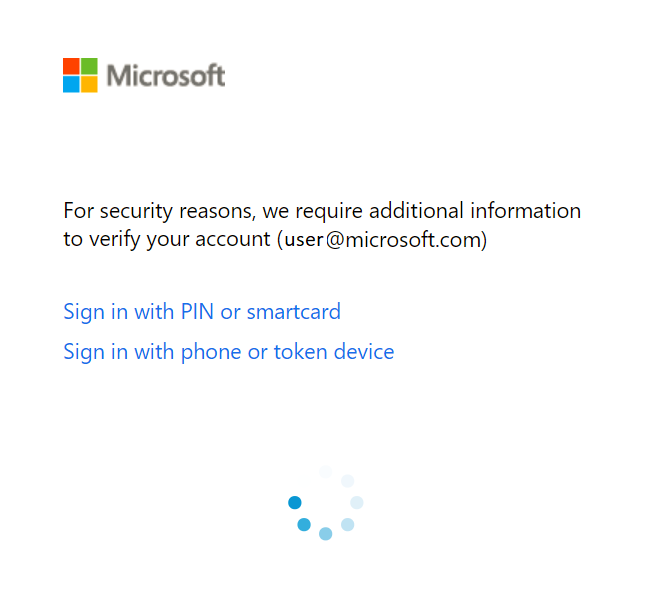

# ADFS MFA Loading Wheel

## Overview

This project provides an ADFS web customization to add as part of your onload.js customizations. The waiting wheel provides UI feedback when a user chooses an MFA method. Some MFA providers perform overhead operations before navigating away from the MFA options page, which means the user may wait up to 3 seconds before page navigation occurs. 

## Getting Started - JavaScript Deployment 

1. Download the ```loadWheel.js``` file to your ADFS server, wherever you host your JavaScript. 
    
    Note: It is *__highly__* recommended that you minify your ```loadWheel.js``` before including it in a production environment. There are many popular tools online 
    for minifying JavaScript code. Two popular choices are [minifier.org](http://www.minifier.org/) and [JSCompress](https://jscompress.com/).

2. Create a custom web theme using the following command in PowerShell: 

    ```New-AdfsWebTheme –Name custom -SourceName default -AdditionalFileResource @{Uri=’/adfs/portal/script/onload.js’; path="c:\loadWheel.js"}```

3. Apply the new custom web theme using the following command in PowerShell:

    ```Set-AdfsWebConfig -ActiveThemeName custom```

4. For more information on JavaScript customization, see [Advanced ADFS Customization](https://docs.microsoft.com/en-us/windows-server/identity/ad-fs/operations/advanced-customization-of-ad-fs-sign-in-pages)

## Example



## Contributing (Special Note)

If you find any problems with the CSS, JavaScript, or docs, please fork and send us your fix. If you don't 
have a fix, please open an issue, and describe what you are seeing (feel free to include screenshots).

For the full Contributing details, please see __[the root README](../README.md)__.